# Reverse engineering - challenge 1
You need to find the flag in the form of: {artist name - song name}.
The complete challenge file is under the directory: the_challenge.
If you want you can only practice the executable file which is under the directory: setup_files.

---

# setup_file
* challenge.c - The challenge program itself.
* hetText.c - Helper program to convert sentences in ASCII-string format to Hex-string format.
* hexTextOutput.txt - Contains the sentences used in the challenge.c file.
* Hashes.txt - Contains MD5 hashes of passwords used in the challenge.c file.
* Reverse-Memes.jpg - Picture for the challenge.
* challenge.exe - The compiled challenge executable file.
---

# Compiling the challenge
1. Make sure gcc installed.
2. Open command prompt.
3. Type: <code>gcc -o challenge.exe challenge.c</code>
4. Type: <code>copy /b challenge.exe + Reverse-Memes.jpg Challenge.jpg</code>
4. Have fun!
---

# Detailed solution
1. Open the <code>.jpg</code> file in Hex-Editor. 
2. Search for <code>PK..</code>, magic-number for <code>.zip</code> files. 
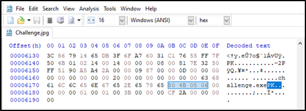
3. Change the file extension to <code>.zip</code> and open the archive. 
4. Extract the challenge.exe file. 
5. Open command-prompt and try some password. 
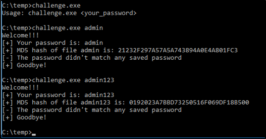
6. Open the executable file in IDA and analyse the binary. 
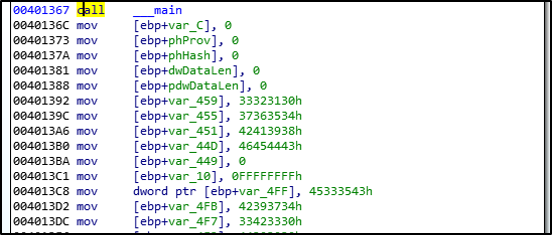
We can see some stack variables and nothing helping to understand the password. 
7. Continue analyzing the binary and find 4 <code>strcpy</code>. 
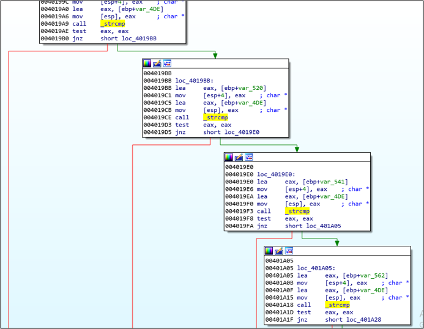 
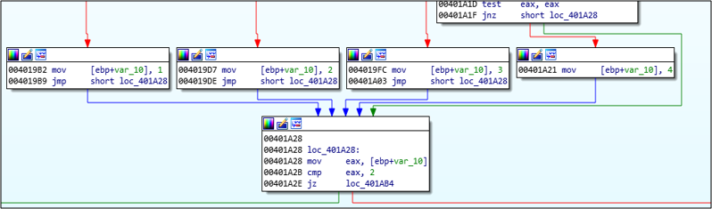
After the compares each brach loads into <code>var_10</code> index value. 
8. Each value of <code>var_10</code> lead into other branch. We need to decide in which branch to focus. 
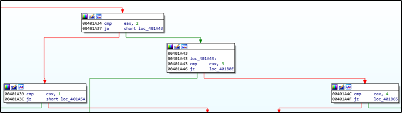
9. We continue with the binary analysis and realize where to look closely. 
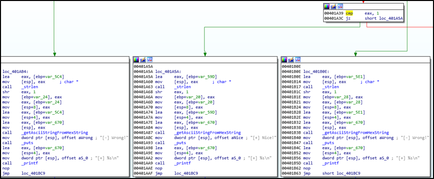
When <code>var_10</code> is equals 1 the program prints "Nice!". 
10. We now knows to focous on this flow -> to jump the program to this location. In order to do this we will use debugger: GDB. 
11. We load the executable with GDB: <code>gdb32.exe challenge.exe</code> 
12. Change the assembly language to Intel syntax: <code>set disassembly-flavor intel</code> 
13. Put break-point befor <code>var_10</code> is loaded into <code>EAX</code> register, as we saw from IDA, using the command: <code>break *0x0401A2B</code> 
14. Run the program with some password: <code>run admin123</code> and we will stop at the breakpoint. 
15. Examine <code>EIP</code> to make sure we reach the right location. 
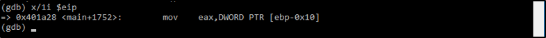
16. Examine <code>EBP-0x10</code> to see the current value, which is: <code>-1</code>. We want to change this value to <code>1</code> to get the location where the program prints: "Nice!". 
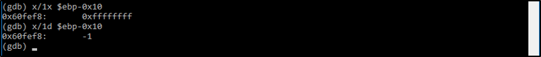
We also realize the location of <code>EBP-0x10</code> in memory which is: 0x60FEF8 
17. Set the value on the stack to 1 using the command: <code>set {int}0x60FEF8 = 1</code>. 
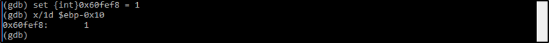
18. Continue the program and get the flag! 
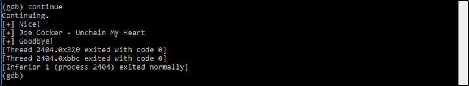
